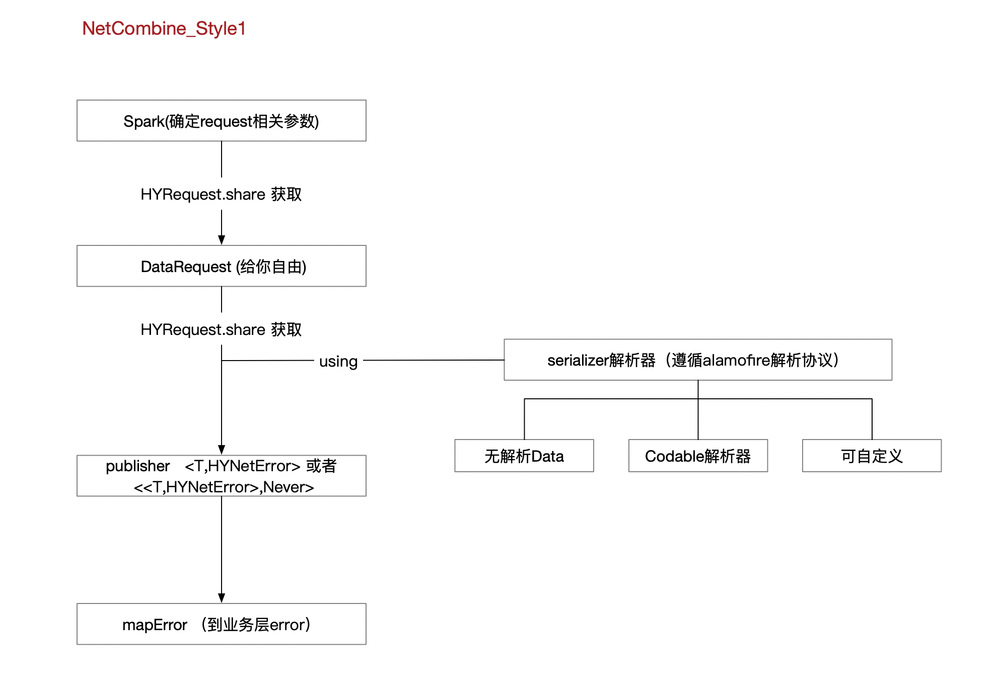
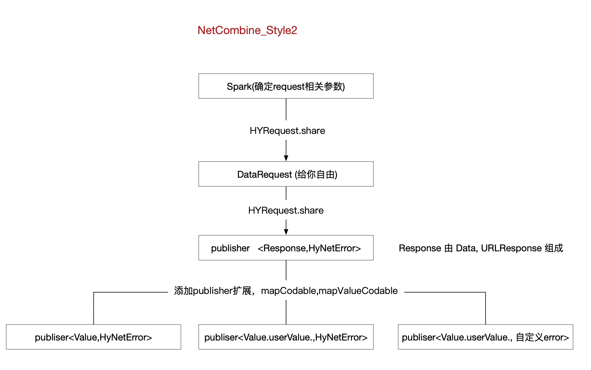

# Alamofire_combine

# 相关文件

1. HYRequest     **处理alamofire 基础设置，生成DataRequest,  生成publisher**
2. HYRequesetSpark      **URLRequest 生成器**
3. HYNetError     **相关错误**
4. HYNetCommonResult 和 HYNetResultMapProtocol       **style1 风格的 数据通用结构 和 解析封装协议 （设计原因，解析是使用 Alamofire的 ResponseSerializer 协议）**
5. Publish_CodAbleEx      **style2 风格   给publisher添加的相关扩展，以及通用数据结构**

# 请求示例

**接口使用方式**

CityAPI.swift   

CityAPI_Style2.swift

**运用**

CityStateControl

CityDetailControl

# 简易设计流程图

**Style1**

**Style2**

